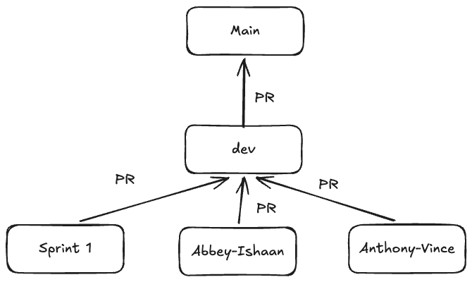

Contribution is limited to 
Abbey, Anthony, Ishaan, and Vince

# Branching Rule for Sprint 2

Branches 

| name | purpose |
|------|-------- |
|main| production ready |
| sprint1 | tasks left over from sprint 1 |
| dev | where we merge our work and acts as a staging branch |
| abbey-ishaan | pair branch |
| anthony-vince | pair branch |

# Pull Request (PR) Rules

- Always make a PR to `dev` to catch conflicts. If no conflicts you can merge
- We only push to main once every requirement is fully integrated in `dev`

# Documentation

